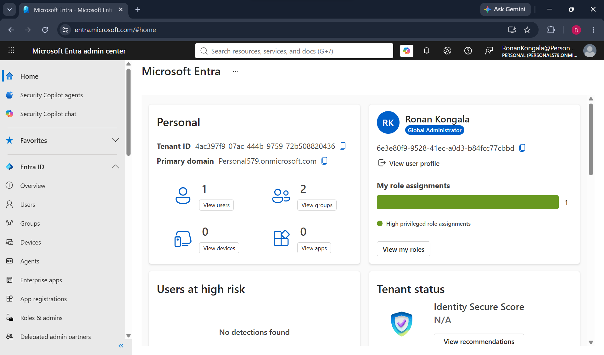
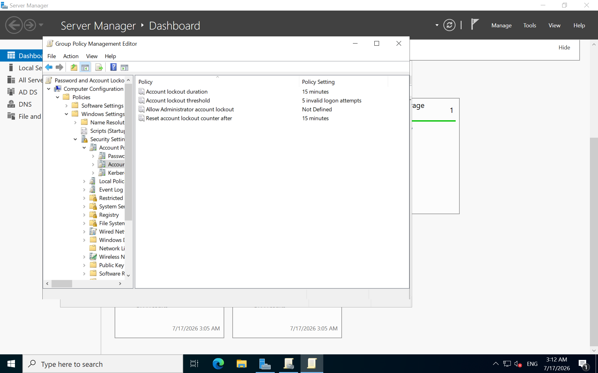
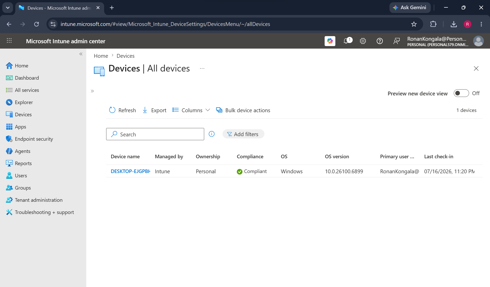
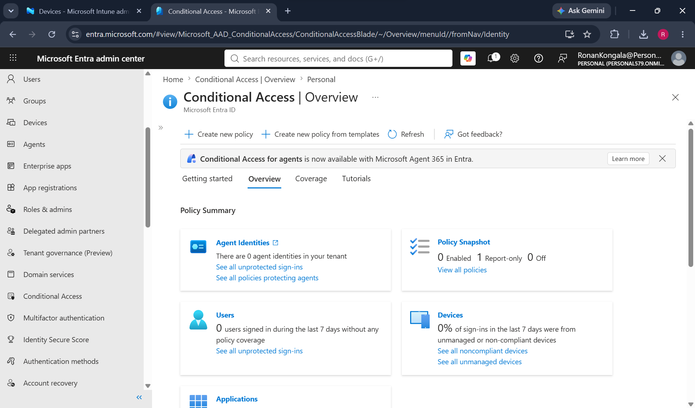
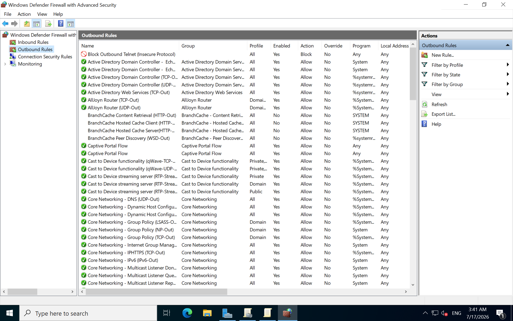
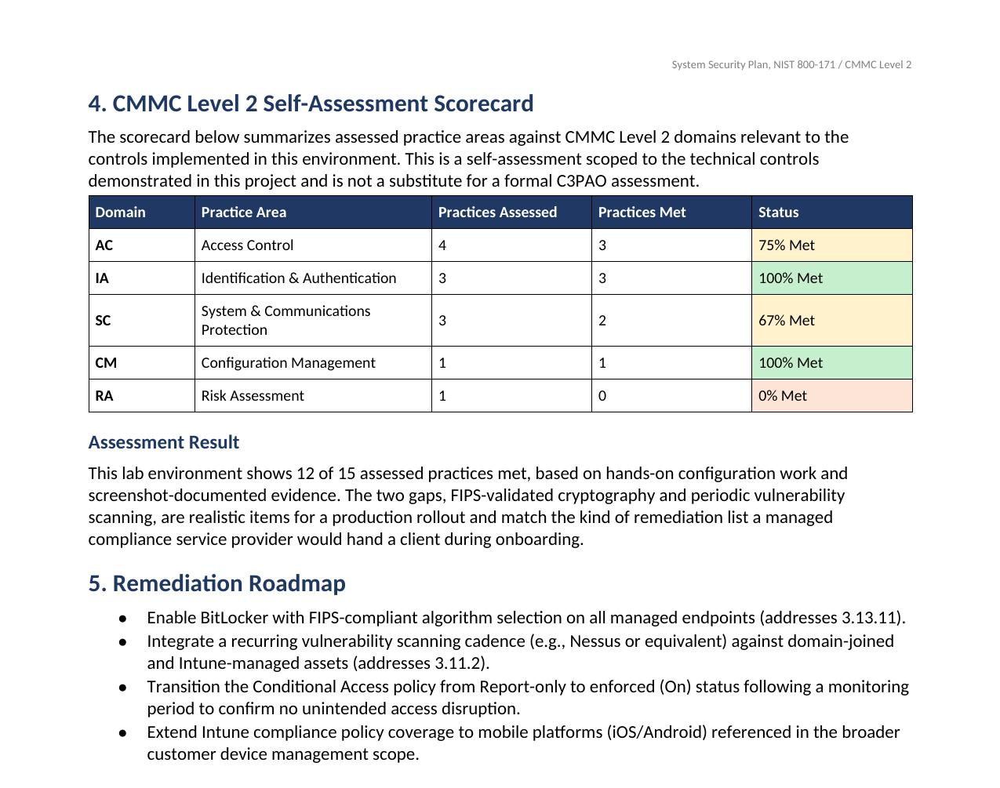
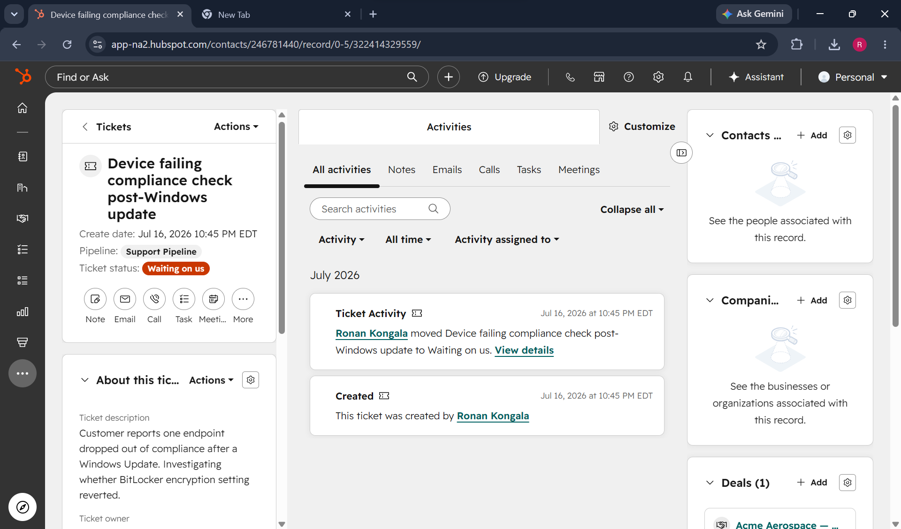

# NIST 800-171 / CMMC Compliance Baseline Lab

A hands-on lab that simulates the environment a small defense contractor would run, and the workflow a managed compliance service provider would use to onboard and support that contractor. Built to demonstrate practical implementation of identity, endpoint compliance, network protection, and compliance documentation, not just theoretical knowledge of the frameworks.

## Why this project

Most of my prior projects covered SOC monitoring, cloud security, and GRC audit work. This lab fills a specific gap: hands-on Active Directory administration, Microsoft Intune device compliance, and Entra ID Conditional Access, tied together under a real NIST 800-171 control mapping and a CMMC Level 2 self-assessment scorecard.

## Architecture

- **Identity:** Windows Server 2022 Domain Controller (Azure IaaS) running Active Directory Domain Services and DNS, with a dedicated Employees OU
- **Cloud identity:** Microsoft Entra ID tenant (Entra ID P2, part of an M365 E3 trial)
- **Policy enforcement:** Group Policy Object linked to the Employees OU, enforcing password complexity, password history, and account lockout thresholds
- **Endpoint compliance:** Microsoft Intune compliance policy evaluating a real enrolled Windows device
- **Access control:** Entra Conditional Access policy requiring device compliance before granting access to cloud apps, deployed in Report-only mode
- **Network protection:** Windows Defender Firewall with Advanced Security, custom rules restricting SMB to the internal subnet and blocking outbound Telnet
- **Documentation:** A System Security Plan and CMMC Level 2 self-assessment scorecard mapping every control above to its NIST 800-171 requirement
- **Customer workflow:** HubSpot CRM simulating a customer onboarding pipeline and a support ticket, similar to how a managed compliance provider tracks a client engagement

## Screenshots

Images live in the `screenshots/` folder in this repo. Each one is real, unedited output from the environment, tenant IDs and object IDs are cropped or blocked out where they appeared.

### Tenant and Azure VM setup

### Active Directory GPO

### Intune device compliance

### Conditional Access

### Firewall hardening

### CMMC Level 2 scorecard

### Customer onboarding simulation

## Control mapping

Full detail is in [`SSP_CMMC_Scorecard.docx`](./SSP_CMMC_Scorecard.docx). Summary:

- 3.1.1, 3.1.8: Active Directory access control and account lockout
- 3.5.7, 3.5.8, 3.5.9: Password complexity, history, and aging
- 3.1.20, 3.1.3, 3.13.1: Firewall rules restricting SMB and insecure protocols
- 3.4.2: Intune-enforced device configuration baseline
- 3.1.1/3.1.2 (Conditional Access): Device compliance required for cloud app access

Two gaps are documented rather than hidden: FIPS-validated cryptography (3.13.11) and periodic vulnerability scanning (3.11.2), both flagged as next steps in the SSP.

## Tools used

Azure IaaS, Windows Server 2022, Active Directory Domain Services, Group Policy, Microsoft Entra ID, Microsoft Intune, Windows Defender Firewall with Advanced Security, HubSpot CRM.

## Notes

This is a personal lab built on a fresh Azure subscription and a separate M365 E3 trial tenant, kept isolated from any employer or school environment. Tenant IDs and object IDs are cropped out of the screenshots above. The Conditional Access policy is deployed in Report-only mode by design, so it logs what would happen without actually blocking sign-ins during testing.
